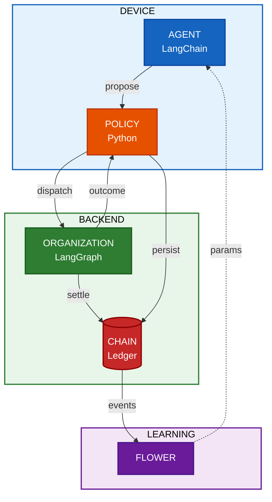
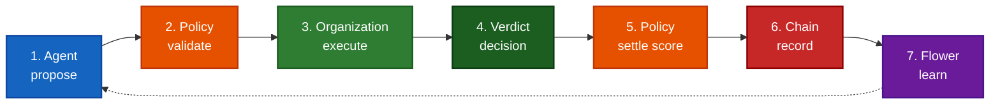
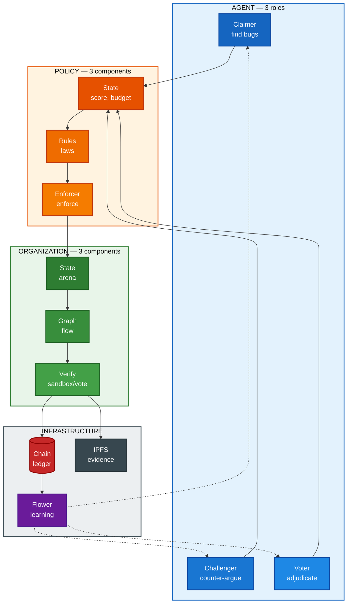

# Overall architecture:

```mermaid
flowchart TB
    subgraph Device["DEVICE"]
        A[AGENT<br/>LangChain]
        P[POLICY<br/>Python]
    end

    subgraph Backend["BACKEND"]
        O[ORGANIZATION<br/>LangGraph]
        C[(CHAIN<br/>Ledger)]
    end

    subgraph ML["LEARNING"]
        F[FLOWER]
    end

    A -->|propose| P
    P -->|dispatch| O
    O -->|outcome| P
    O -->|settle| C
    P -->|persist| C
    C -->|events| F
    F -.->|params| A

    style A fill:#1565C0,color:#FFFFFF,stroke:#0D47A1,stroke-width:2px
    style P fill:#E65100,color:#FFFFFF,stroke:#BF360C,stroke-width:2px
    style O fill:#2E7D32,color:#FFFFFF,stroke:#1B5E20,stroke-width:2px
    style C fill:#C62828,color:#FFFFFF,stroke:#8E0000,stroke-width:2px
    style F fill:#6A1B9A,color:#FFFFFF,stroke:#4A148C,stroke-width:2px

    style Device fill:#E3F2FD,stroke:#1565C0,stroke-width:2px,color:#000000
    style Backend fill:#E8F5E9,stroke:#2E7D32,stroke-width:2px,color:#000000
    style ML fill:#F3E5F5,stroke:#6A1B9A,stroke-width:2px,color:#000000
```

# Flow

```mermaid
flowchart LR
    S1[1. Agent<br/>propose] --> S2[2. Policy<br/>validate]
    S2 --> S3[3. Organization<br/>execute]
    S3 --> S4[4. Verdict<br/>decision]
    S4 --> S5[5. Policy<br/>settle score]
    S5 --> S6[6. Chain<br/>record]
    S6 --> S7[7. Flower<br/>learn]
    S7 -.-> S1

    style S1 fill:#1565C0,color:#FFFFFF,stroke:#0D47A1,stroke-width:2px
    style S2 fill:#E65100,color:#FFFFFF,stroke:#BF360C,stroke-width:2px
    style S3 fill:#2E7D32,color:#FFFFFF,stroke:#1B5E20,stroke-width:2px
    style S4 fill:#1B5E20,color:#FFFFFF,stroke:#0D3D14,stroke-width:2px
    style S5 fill:#E65100,color:#FFFFFF,stroke:#BF360C,stroke-width:2px
    style S6 fill:#C62828,color:#FFFFFF,stroke:#8E0000,stroke-width:2px
    style S7 fill:#6A1B9A,color:#FFFFFF,stroke:#4A148C,stroke-width:2px
```

# Components

```mermaid
flowchart TB
    subgraph Agents["AGENT — 3 roles"]
        direction LR
        A1[Claimer<br/>find bugs]
        A2[Challenger<br/>counter-argue]
        A3[Voter<br/>adjudicate]
    end

    subgraph Policy["POLICY — 3 components"]
        direction LR
        P1[State<br/>score, budget]
        P2[Rules<br/>laws]
        P3[Enforcer<br/>enforce]
    end

    subgraph Org["ORGANIZATION — 3 components"]
        direction LR
        O1[State<br/>arena]
        O2[Graph<br/>flow]
        O3[Verify<br/>sandbox/vote]
    end

    subgraph Ext["INFRASTRUCTURE"]
        direction LR
        C[(Chain<br/>ledger)]
        F[Flower<br/>learning]
        I[IPFS<br/>evidence]
    end

    A1 & A2 & A3 --> P1
    P1 --> P2 --> P3
    P3 --> O1
    O1 --> O2 --> O3
    O3 --> C
    O3 --> I
    C --> F
    F -.-> A1 & A2 & A3

    style A1 fill:#1565C0,color:#FFFFFF,stroke:#0D47A1,stroke-width:2px
    style A2 fill:#1976D2,color:#FFFFFF,stroke:#0D47A1,stroke-width:2px
    style A3 fill:#1E88E5,color:#FFFFFF,stroke:#0D47A1,stroke-width:2px

    style P1 fill:#E65100,color:#FFFFFF,stroke:#BF360C,stroke-width:2px
    style P2 fill:#EF6C00,color:#FFFFFF,stroke:#BF360C,stroke-width:2px
    style P3 fill:#F57C00,color:#FFFFFF,stroke:#BF360C,stroke-width:2px

    style O1 fill:#2E7D32,color:#FFFFFF,stroke:#1B5E20,stroke-width:2px
    style O2 fill:#388E3C,color:#FFFFFF,stroke:#1B5E20,stroke-width:2px
    style O3 fill:#43A047,color:#FFFFFF,stroke:#1B5E20,stroke-width:2px

    style C fill:#C62828,color:#FFFFFF,stroke:#8E0000,stroke-width:2px
    style F fill:#6A1B9A,color:#FFFFFF,stroke:#4A148C,stroke-width:2px
    style I fill:#37474F,color:#FFFFFF,stroke:#263238,stroke-width:2px

    style Agents fill:#E3F2FD,stroke:#1565C0,stroke-width:2px,color:#000000
    style Policy fill:#FFF3E0,stroke:#E65100,stroke-width:2px,color:#000000
    style Org fill:#E8F5E9,stroke:#2E7D32,stroke-width:2px,color:#000000
    style Ext fill:#ECEFF1,stroke:#37474F,stroke-width:2px,color:#000000
```
